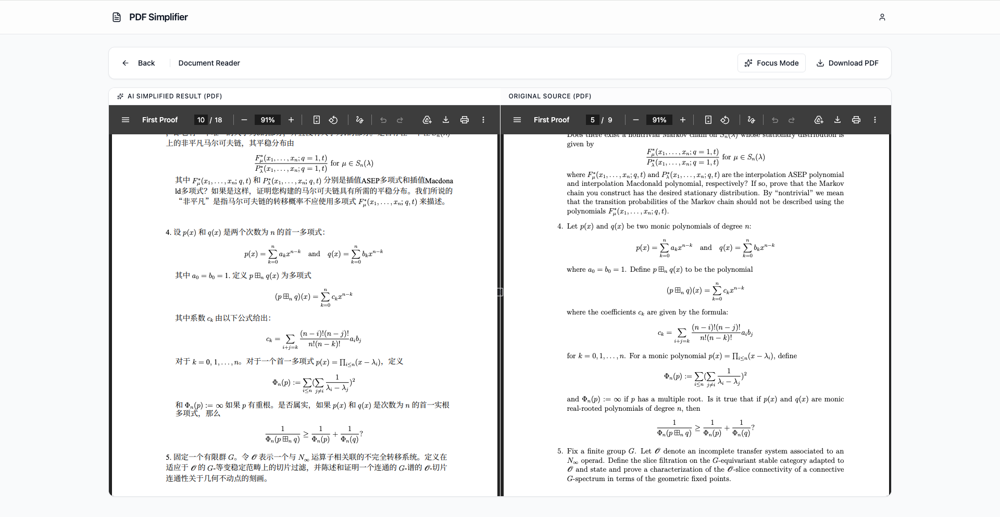
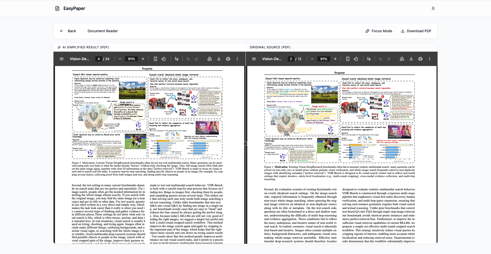

# EasyPaper

**把论文变成带得走的知识。**

EasyPaper 是一个可本地部署的 Web 应用，帮助你阅读、理解并留住英文学术论文中的知识。上传一个 PDF — 获取翻译或简化版本（排版完整保留）、AI 重点高亮，以及可导出到任何平台的便携知识库。

[English](README.md)

---

## 核心功能

### 1. 翻译 & 简化

- **英文 → 中文** 翻译，保留排版、图片和公式（基于 [pdf2zh](https://github.com/Byaidu/PDFMathTranslate)）
- **英文 → 简单英文** 词汇简化（CEFR A2/B1 级别，约 2000 常用词）
- PDF 输入，PDF 输出 — 图表、公式、格式完整保留

### 2. AI 重点高亮

自动识别并用颜色标注 PDF 中的关键句子：

| 颜色 | 分类 | 标注内容 |
|------|------|---------|
| 黄色 | 核心结论 | 主要发现和研究成果 |
| 蓝色 | 方法创新 | 新颖方法和技术贡献 |
| 绿色 | 关键数据 | 定量结果、指标、实验数据 |


### 3. 知识库（可迁移）

通过 LLM 从论文中提取结构化知识 — 以便携 JSON 格式存储，不与本应用绑定：

- **实体**：方法、模型、数据集、指标、概念、任务、人物、机构
- **关系**：扩展、使用、评估于、优于、类似、矛盾、属于、依赖
- **发现**：结果、局限性、贡献，附带证据引用
- **闪卡**：自动生成的学习卡片，支持 SM-2 间隔重复调度


### 4. 知识图谱

交互式力导向图谱，可视化所有论文中的实体与关系。按实体类型着色，按重要性调整大小，支持搜索和缩放。

### 5. 多格式导出

知识是你的，随时带走：

| 格式 | 扩展名 | 用途 |
|------|--------|------|
| EasyPaper JSON | `.epaper.json` | 完整便携知识（主格式） |
| Obsidian Vault | `.zip` | 含双向链接的 Markdown 笔记 |
| BibTeX | `.bib` | LaTeX 引用管理 |
| CSL-JSON | `.json` | Zotero / Mendeley 兼容 |
| CSV | `.zip` | 电子表格分析（实体 + 关系） |

### 6. 闪卡复习

内置间隔重复系统（SM-2 算法），复习自动生成的闪卡。按 0-5 评分你的记忆效果，系统自动安排最优复习间隔。


---

## 效果展示

### 翻译为中文


### 简化英文


### 保留排版技术


---

## 快速开始

### 方式一：Docker 部署（推荐）

```bash
cp backend/config/config.example.yaml backend/config/config.yaml
# 编辑 config.yaml — 填入你的 API Key，选择模型

docker compose up --build
```

浏览器打开 http://localhost 即可使用。

### 方式二：本地开发

**环境要求：** Python 3.10+、Node.js 18+、一个 OpenAI 兼容的 LLM API Key

**启动后端：**

```bash
cd backend
python -m venv .venv
source .venv/bin/activate
pip install -r requirements.txt

cp config/config.example.yaml config/config.yaml
# 编辑 config.yaml — 填入你的 API Key

uvicorn app.main:app --reload
```

**启动前端：**

```bash
cd frontend
npm install
npm run dev
```

浏览器打开 http://localhost:5173 即可使用。

---

## 配置说明

编辑 `backend/config/config.yaml`：

```yaml
llm:
  api_key: "YOUR_API_KEY"             # 必填 — 任意 OpenAI 兼容 API
  base_url: "https://api.example.com/v1"
  model: "gemini-2.5-flash"           # 翻译/简化/知识提取使用的模型
  judge_model: "gemini-2.5-flash"

processing:
  max_pages: 100
  max_upload_mb: 50
  max_concurrent: 3                   # 最大并发处理任务数

storage:
  cleanup_minutes: 30                 # 临时文件过期时间（分钟）
  temp_dir: "./backend/tmp"

database:
  url: "sqlite:///./data/app.db"

security:
  secret_key: "CHANGE_THIS"           # JWT 签名密钥 — 生产环境必须修改
  cors_origins:
    - "http://localhost:5173"
```

---

## 技术栈

| 组件 | 技术 |
|------|------|
| 后端 | FastAPI, PyMuPDF, pdf2zh (PDFMathTranslate), httpx |
| 前端 | React 18, TypeScript, Vite, Tailwind CSS, Radix UI |
| 数据库 | SQLite（SQLModel） |
| 认证 | JWT (python-jose), bcrypt, OAuth2 bearer |
| AI/LLM | 任意 OpenAI 兼容 API（可配置） |
| 工程化 | Docker Compose, GitHub Actions, ruff, ESLint |

---

## API 概览

| 接口 | 说明 |
|------|------|
| `POST /api/upload` | 上传 PDF（翻译/简化，可选高亮） |
| `GET /api/status/{id}` | 处理状态与进度 |
| `GET /api/result/{id}/pdf` | 下载处理后的 PDF |
| `POST /api/knowledge/extract/{id}` | 触发知识提取 |
| `GET /api/knowledge/papers` | 知识库论文列表 |
| `GET /api/knowledge/graph` | 知识图谱（实体 + 关系） |
| `GET /api/knowledge/flashcards/due` | 到期闪卡 |
| `POST /api/knowledge/flashcards/{id}/review` | 提交复习结果 |
| `GET /api/knowledge/export/json` | 导出完整知识库 |
| `GET /api/knowledge/export/obsidian` | 导出为 Obsidian 笔记库 |
| `GET /api/knowledge/export/bibtex` | 导出为 BibTeX |

---

## 开发指南

```bash
# 后端
cd backend
ruff check app/
pytest

# 前端
cd frontend
npm run lint
npm run type-check
npm test
```

---

## 开源协议

MIT
